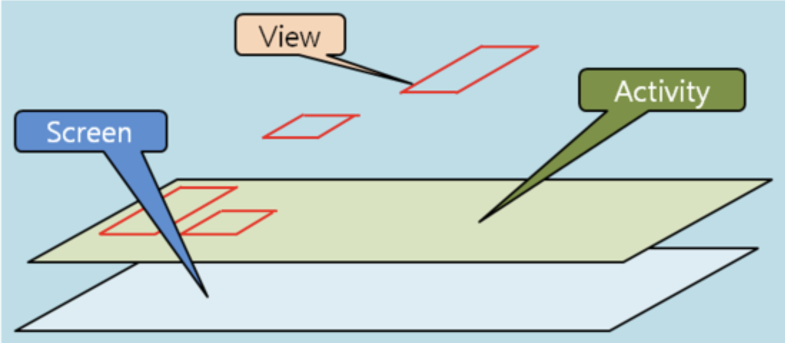

## 안드로이드 액티비티

##### 액티비티의 뜻

활동!

활동?

유저가 UI **화면 안에서 일어나는 모든 활동을 담당**하는 곳이 Activity

---

##### 액티비티란 무엇인가?

안드로이드의 4대 컴포넌트 중 하나

모든 뷰들을 담는 콘테이너와 같은 역할



> 스크린(Screen)
>
> > 액티비티(Activity)
> >
> > > 뷰(View)

---

##### MainActivity

.png)
안드로이드 매니페스트에서는 액티비티를 포함한 4대 컴포넌트 정보들을 볼 수 있다.
---

##### MainActivity (2)

```
class MainActivity : AppCompatActivity() {
    override fun onCreate(savedInstanceState: Bundle?) {
        super.onCreate(savedInstanceState)
        setContentView(R.layout.activity_main)
    }
}
```

---

##### Bundle이란?

Bundle은 Map클래스로, 여러가지 타입의 값을 저장할 때 사용.

또한 Activity간에 데이터를 주고 받을 때 Bundle 클래스를 사용하여 데이터를 전송

---

##### Bundle - Code Example

```java
보내는 쪽
Message msg = mHandler.obtainMessage();

Bundle bundle = new Bundle();
bundle.putString("text", "메시지 내용입니다");
msg.setData(bundle);
mHandler.sendMessage(msg);

받는 쪽
Bundle bundle = msg.getData();
String receiveText = bundle.getString("text");
```

위와 같은 방식으로 액티비티 데이터 손실을 막음

---

**AppCompatActivity 클래스 (android.app.support.v7.app.AppCompatActivity)** 
과거 안드로이드 버전과의 호환성을 유지하면서 새로운 버전의 기능도 사용할 수 있도록 만든 액티비티 클래스다. 이 클래스는 안드로이드 6.0(마시멜로)의 **새로운 기능**(Material Design 관련)도 많은 부분 구현하고 있다.

안드로이드 스튜디오 1.5 버전부터는 프로젝트 생성 시에 액티비티를 **AppCompatActivity** 클래스의 서브 클래스로 생성해준다.
ㄴ
---

##### 액티비티 생명주기란?

액티비티의 상태가 변경된다는 것을 그 액티비티에게 알려주는 역할을 하는 메서드들을 `액티비티 생명주기 메서드`라고 한다. 보통 필요한 메서드들을 오버라이드하여 필요한 기능들을 구현한다. 단, onCreate 메서드는 반드시 구현해야 한다.

---

.png)

---

##### 액티비티 생명주기가 필요한 이유는?

데이터 유실을 막기 위함

- 즉, 액티비티가 **백그라운드 상태로 있을 때**는 런타임 시스템이 그 액티비티를 종료시키면서 액티비티의 데이터가 없어질 수 있다.

---

**onCreate(Bundle savedInstanceState)** - 이 메서드는 **액티비티 인스턴스가 최초로 생성될 때 호출**되며, **대부분의 초기화 작업**을 진행한다.

**onRestart( )** - 액티비티가 런타임 시스템에 의해 **이전에 중단되었다가 막 다시 시작될 때 호출**된다.

**onStart( )** - 예외없이 **onCreate( )나 onRestart( ) 메서드가 호출된 후 바로 호출**된다. 그리고 액티비티의 사용자 인터페이스가 곧 사용자에게 보이게 될 것이라고 액티비티에게 알려준다.

**onResume( )** - 액티비티가 **액티비티 스택의 맨 위**에 있으며, 사용자가 **현재 상호 동작하는 (실행 중인)액티비티**임을 알려준다. // 액티비티 스택의 맨 위에 있는 액티비티가 현재 화면에 보이는 액티비티다.

**onPause( )** - 이 메서드 호출 다음에는 **onResume( ) 또는 onStop( )** 메서드 중 하나가 호출된다. **액티비티가 포그라운드로 돌아가는 경우 계속 실행하기 위해 onResume( )**가 호출되며, **액티비티의 사용자 인터페이스를 사용자가 볼 수 없게 되면 중단되면서 onStop( )가 호출**된다.

**onStop( )** - 이 메서드가 호출될 때는 **액티비티가 더 이상 사용자에게 보이지 않는다.** 이 메서드 호출 다음에는 **onRestart( ) 또는 onDestroy( )**가 호출된다. 액티비티가 다시 포그라운드로 들어가면 **onRestart( )**가 호출되며, 액티비티가 종료될 때는 **onDestroy( )**가 호출된다.

**onDestroy( )** - 이 메서드는 **액티비티가 막 소멸되려고 하거나 혹은 자발적으로 소멸될 때 호출**된다. 

---

##### View란 무엇인가?

액티비티 위에 뷰들이 배치됨.

뷰란 눈에 가시적으로 표현되는 모든 것들.

ex) 버튼, 이미지, 테이블 등...


---

##### 2.View

모든 뷰들의 상속 관계

Object 클래스는 모든 클래스의 부모임.

.png)

---

View 계열의 클래스는 가시적으로 모양이 있는 클래스이고,

ViewGroup 계열의 클래스는 눈에는 보이지 않지만 뷰들을 잘 배치하거나 그룹핑하는 역할 담당 (View와 ViewGroup들을 담는 컨테이너 역할을 담당)

---

##### View의 속성

- id: 해당 뷰의 고유 번호
- layout_width: 가로크기
- layout_height: 세로크기
- background: 백그라운드 색상

---

```xml
<?xml version="1.0" encoding="utf-8"?>
<LinearLayout xmlns:android="http://schemas.android.com/apk/res/android"
              android:layout_width="match_parent"
              android:layout_height="match_parent"
              android:orientation="vertical" >
    <Button android:id="@+id/button1"
            android:layout_width="wrap_content"
            android:layout_height="wrap_content"
            android:text="BUTTON1" />
</LinearLayout>
```

`android:`  : 안드로이드의 기본 API에서 정의한 속성이라는 의미

- match_parent: 뷰를 담고 있는 뷰그룹의 여유 공간을 꽉 채운다
- wrap_content: 뷰에 들어 있는 내용물의 크기에 자동으로 맞춘다

---

##### 액티비티 실행

어떠한 Intent(의도)를 가지고 Activity를 실행하는가

Intent

- 명시적(Explict)
- 암묵적(Implicit)

##### Explict Intent

.png)

---

##### Implicit Intent

.png)

---

##### Code Example

```java
//명시적
Intent intent = new Intent(this, A.class) ;
startActivity(intent);

//암묵적
Intent intent = new Intent(Intent.ACTION_DIAL, Uri.parse("tel:010-999-9999"));
startActivity(intent) ;
```

---

##### Activity Stack 관리

- Activity간 전환되었을 때 Activity간 전환되었을 때 Activity Stack 관리됨
- Android에서는 Activity가 실행될 때 마다 Stack에 Activity를 저장해둠
- 액티비티는 리눅스 커널의 프로세스로 실행된다. 그렇기 때문에 많은 activity가 실행될 경우 Memory를 관리할 방법이 필요
- 이때, 액티비티를 관리할 수 있는 방법이 `Flag` 다.

##### Tips

액티비티가 어떻게 구성되어 있는지 보고싶을 땐?

- Developer Options => Drawing => Show layout boundaries

---

.png)

##### 대표적인 Flag

| 속성                     | 설명                                                        |
| ------------------------ | ----------------------------------------------------------- |
| FLAG_ACTIVITY_SINGLE_TOP | 이미 생성된 Activity가 있다면 그대로 사용                   |
| FLAG_ACTIVITY_NO_HISTORY | 처음 이후 실행되는 Activity는 액티비티 스택에 들어가지 않음 |
| FLAG_ACTIVITY_CLEAR_TOP  | 현재 Activity 이외의 모든 Activity는 모두 종료 시킴         |


##### FLAG_ACTIVITY_SINGLE_TOP

.png)

##### 

##### FLAG_ACTIVITY_NO_HISTORY 

.png)


##### FLAG_ACTIVITY_CLEAR_TOP 

.png)


##### Intent Flag 적용방법

(1) intent에 addFlag

```
Intent intent = new Intent(this, MyActivity.class);
intent.addFlag(Intent.FLAG_ACTIVITY_CLEAR_TOP)
startActivity(intent);
```


(2) Manifest의 해당 Activity 태그내 선언

```
<application
        android:name=".application.AvILoSApplication"
        android:allowBackup="true"
        android:icon="@mipmap/ic_>
        <activity
          android:name=".ui.activity.AvILoSSplashActivity"
          android:label="@string/title_activity_splash"
          
          <!-- 여기에 LaunchMode로 플래그 설정 -->
          android:launchMode="singleInstance"/>
/>
```


##### 참고 링크

[1.WiseCow blog](https://mattlee.tistory.com/73)

[2.모프 blog](<https://m.blog.naver.com/PostView.nhn?blogId=highkrs&logNo=220488213481&proxyReferer=https%3A%2F%2Fwww.google.com%2F>)

[3.안드로이드 레시피 blog](<https://recipes4dev.tistory.com/67>)

[4.LovelySky blog](<https://loveiskey.tistory.com/169>)


etc

