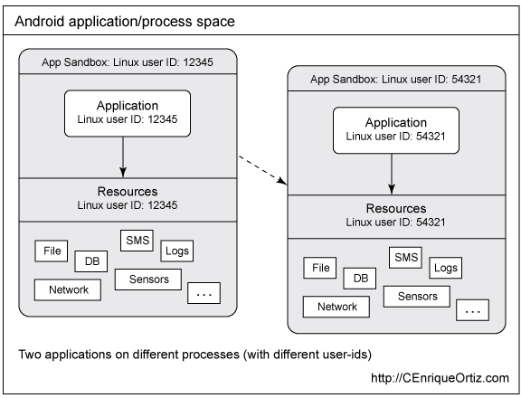
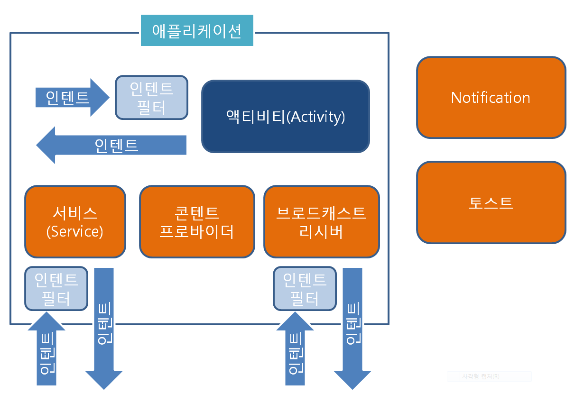
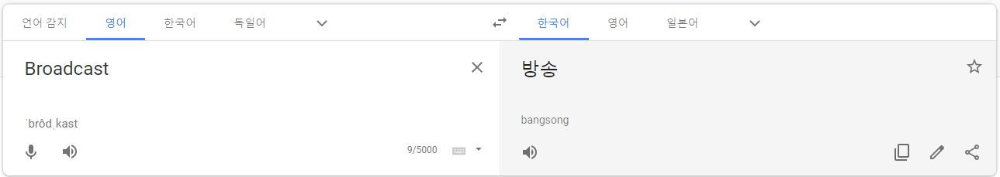

# Android Broadcast Reciever


Android Sandbox



Android 4대 컴포넌트



(https://j07051.tistory.com/279)

>A broadcast receiver is a component that enables the system to deliver events to the app outside of a regular user flow, allowing the app to respond to system-wide broadcast announcements. Because broadcast receivers are another well-defined entry into the app, the system can deliver broadcasts even to apps that aren't currently running. So, for example, an app can schedule an alarm to post a notification to tell the user about an upcoming event... and by delivering that alarm to a BroadcastReceiver of the app, there is no need for the app to remain running until the alarm goes off. Many broadcasts originate from the system—for example, a broadcast announcing that the screen has turned off, the battery is low, or a picture was captured. Apps can also initiate broadcasts—for example, to let other apps know that some data has been downloaded to the device and is available for them to use. Although broadcast receivers don't display a user interface, they may create a status bar notification to alert the user when a broadcast event occurs. More commonly, though, a broadcast receiver is just a gateway to other components and is intended to do a very minimal amount of work. For instance, it might schedule a JobService to perform some work based on the event with JobScheduler
>
>A broadcast receiver is implemented as a subclass of BroadcastReceiver and each broadcast is delivered as an Intent object. For more information, see the BroadcastReceiver class.


## Broadcasts 란?




Android App은 Android System 및 다른 Android App에서 Broadcasts 메세지를 보내거나 받을 수 있음.

Publish-Subscribe 패턴과 유사.


### System Broadcasts

Android System에서 다양한 이벤트시 Broadcasts를 전송함.

* 시스템의 상태 (배터리 상태, 통신 상태, SD카드 삽입 등)
* App에서 특정 작업이 완료되었을 때 처리할 동작 등

Broadcasts를 전송하면 해당 이벤트를 수신하기 위해 등록한 모든 앱으로 전송 됨.

Broadcasts 메세지 자체는 Intent action 문자열로 발생한 이벤트를 식별하는 객체로 래핑됨.

System의 Broadcast action 목록은 Adnroid SDK에서 확인 가능함.

\sdk\platforms\android-xx\data\broadcast_actions.txt 

```txt
...
android.intent.action.ACTION_POWER_CONNECTED
android.intent.action.ACTION_POWER_DISCONNECTED
android.intent.action.ACTION_SHUTDOWN
android.intent.action.AIRPLANE_MODE
android.intent.action.APPLICATION_RESTRICTIONS_CHANGED
android.intent.action.BATTERY_CHANGED
android.intent.action.BATTERY_LOW
android.intent.action.BATTERY_OKAY
android.intent.action.BOOT_COMPLETED
...
```


### Custom Broadcasts

Broadcasts를 보낼 App에서 사용자 정의 Broadcasts를 보낼 수 있음.

또한 Braodcasts를 받을 App에서는 특정 Broadcasts를 수신하도록 등록도 가능함.

App에서 메시징 시스템으로 사용할 수 있으므로 백그라운드 작업시 유의해야 함.


## Broadcasts 수신

App에서 Broadcasts를 수신하기 위해 Receiver를 등록하는 방법은 2가지


### 1. Manifest 선언

App Manifest에 Broadcast Receiver가 선언이 되어 있다면 System에서 Broadcast를 보낼 때 App 을 실행함. (미실행 중일 경우)

1. AndroidManifest.xml에 \<receiver\> 지정
   intent-fitler의 action에는 Receiver가 참고할 Broadcast 액션을 지정

   ```xml
   <receiver android:name=".MyBroadcastReceiver"  android:exported="true">
       <intent-filter>
           <action android:name="android.intent.action.BOOT_COMPLETED"/>
           <action android:name="android.intent.action.INPUT_METHOD_CHANGED" />
       </intent-filter>
   </receiver>
   ```

2. BroadcastReceiver 서브 클래스에 onReceive(Context, Intent) 를 구현.

   ```kotlin
   class MyBroadcastReceiver : BroadcastReceiver() {
       override fun onReceive(context: Context, intent: Intent) {
           StringBuilder().apply {
               append("Action: ${intent.action}\n")
               append("URI: ${intent.toUri(Intent.URI_INTENT_SCHEME)}\n")
               toString().also { log ->
                   Log.d(TAG, log)
                   Toast.makeText(context, log, Toast.LENGTH_LONG).show()
               }
           }
       }
   }
   ```

> App API 레벨이 26 이상이라면 Manifest에 암시적 Broadcast를 위한 선언을 사용할 수 없음.
> (Broadcast가 해당 App을 특별히 지정하지 않는다면)
> https://developer.android.com/guide/components/broadcast-exceptions.html
> 제한으로부터 제외된 몇몇 암시적 Broadcast 는 제외.

System Package Manager는 App이 설치될 때 Receiver를 등록.

App이 실행 중이 아니더라도 System이 App을 시작하고 Receiver에 Broadcast를 전달함.

System은 Broadcast를 처리할 때마다 BroadcastReceiver 컴포넌트 객체를 생성하며, onReceive() 동안만 유효함.


### 2. Context 등록

1. BroadcastReceiver 인스턴스를 생성함.

   ```kotlin
   val br: BroadcastReceiver = MyBroadcastReceiver()
   ```

   

2. IntentFilter 를 생성하고 registerReceiver(BroadcastReceiver, IntentFilter) 를 호출하여 Receiver를 등록.

   ```kotlin
   val filter = IntentFilter().apply {
       addAction(Intent.ACTION_AIRPLANE_MODE_CHANGED)
   }
   registerReceiver(br, filter)
   ```

   ```verilog
   2019-07-15 17:00:36.138 12172-12172/com.example.brsample D/MyBroadcastReceiver: Action: android.intent.action.AIRPLANE_MODE
       URI: intent:#Intent;action=android.intent.action.AIRPLANE_MODE;launchFlags=0x10;B.state=true;end
   2019-07-15 17:00:40.079 12172-12172/com.example.brsample D/MyBroadcastReceiver: Action: android.intent.action.AIRPLANE_MODE
       URI: intent:#Intent;action=android.intent.action.AIRPLANE_MODE;launchFlags=0x10;B.state=false;end
   ```

   > Local Broadcast 등록시에는 LocalBroadcastManager.registerReceiver(BroadcastReceiver, IntentFilter) 를 대신 호출함.

   Context에 등록된 Receiver는 등록한 Context가 유효한 동안 Broadcast를 받음. (Activity or Application)

   

3. Broadcast 를 받는 것을 멈출 때는 unregisterReceiver(BroadcastReceiver) 를 호출함.
   Receiver가 필요 없거나 Context가 유효하지 않을때 unregister를 해줘야 함.

   ```verilog
   2019-07-15 17:07:43.217 15288-15288/com.example.brsample E/ActivityThread: Activity com.example.brsample.MainActivity has leaked IntentReceiver com.example.brsample.MyBroadcastReceiver@55831d5 that was originally registered here. Are you missing a call to unregisterReceiver()?
       android.app.IntentReceiverLeaked: Activity com.example.brsample.MainActivity has leaked IntentReceiver com.example.brsample.MyBroadcastReceiver@55831d5 that was originally registered here. Are you missing a call to unregisterReceiver()?
   ```


위와 같은 이유로 Receiver를 등록하고 해제하는 시점을 염두해야 함.

onCreate(Bundle) 과 onDestroy(), onResume() 과 onPause() 와 같이 짝이 맞게 등록 해제를 해주는 것이 좋음.

onSaveInstanceState(Bundle) 시에는 unregister를 하지 말 것. (뒤로 가기 등 시에 호출되지 않음)

```kotlin
class MainActivity : AppCompatActivity() {
    val br: BroadcastReceiver = MyBroadcastReceiver()

    override fun onCreate(savedInstanceState: Bundle?) {
        super.onCreate(savedInstanceState)
        setContentView(R.layout.activity_main)
        regesterBR()
    }

    override fun onDestroy() {
        unRegisterBR()
        super.onDestroy()
    }

    private fun regesterBR() {
        val filter = IntentFilter().apply {
            addAction(Intent.ACTION_AIRPLANE_MODE_CHANGED)
        }
        registerReceiver(br, filter)
    }

    private fun unRegisterBR() {
        unregisterReceiver(br)
    }
}
```


### Process 영향

BroadcastReceiver의 상태는 그것을 포함한 Process의 상태에 영향을 미침. (실행 중이든 아니든)

System에 의한 종료 가능성에 영향을 줄 수 있음.

예를 들면 Process가 Receiver를 실행할 때 (onReceive 메서드 등) foreground Process로 간주함.

메모리 부족한 경우를 제외하고는 System은 Process를 계속 실행함.

onReceive() 이후 시스템은 메모리 회수를 위해 Process를 언제든 종료할 수 있으며, 그런 경우 Process에서 실행되는 생성된 스레드가 종료됨.

이를 방지하기 위해 백그라운드 스레드에서 Broadcast 를 처리하는 데 시간이 필요하면 goAsync()를 호출하거나, Receiver에서 JobScheduler를 사용해 JobService를 예약해야 함. 

그래서 System에서 Process가 계속 활성 작업을 수행하고 있음을 알게 함.

```kotlin
private const val TAG = "MyBroadcastReceiver"

class MyBroadcastReceiver : BroadcastReceiver() {

    override fun onReceive(context: Context, intent: Intent) {
        val pendingResult: PendingResult = goAsync()
        val asyncTask = Task(pendingResult, intent)
        asyncTask.execute()
    }

    private class Task(
            private val pendingResult: PendingResult,
            private val intent: Intent
    ) : AsyncTask<String, Int, String>() {

        override fun doInBackground(vararg params: String?): String {
            val sb = StringBuilder()
            sb.append("Action: ${intent.action}\n")
            sb.append("URI: ${intent.toUri(Intent.URI_INTENT_SCHEME)}\n")
            return toString().also { log ->
                Log.d(TAG, log)
            }
        }

        override fun onPostExecute(result: String?) {
            super.onPostExecute(result)
            // Must call finish() so the BroadcastReceiver can be recycled.
            pendingResult.finish()
        }
    }
}
```


## Broadcasts 송신

Android에서는 Broadcasts 송신시 3가지 방법을 제공함.


### 1. sendOrderedBroadcast

```java
public void sendOrderedBroadcast(Intent intent, String receiverPermission)
```

sendOrderedBroadcast(Intent, String) 메서드로 한번에 한 Receiver에 Broadcast 를 보냄.
각각의 Receiver는 차례로 실행되면, 다음 Receiver에 결과를 전달할 수 있거나 다른 수신자에게 전달되지 않도록 Broadcast를 완전히 중단할 수 있음. 
(BroadcastReceiver 내에서 abortBroadcast() 메서드 사용시)
오더 Receiver는 인텐트 필터가 일치하고 android:priority 속성을 사용하여 제어할 수 있음. (priority 높을수록 우선순위)
우선 순위가 동일한 수신자는 임의의 순서로 실행됨.

```kotlin
Intent().also { intent ->
    intent.setAction("com.example.broadcast.MY_NOTIFICATION")
    intent.putExtra("data", "Notice me senpai!")
    sendOrderedBroadcast(intent, null)
}
```


### 2. sendBroadcast

```java
public void sendBroadcast(Intent intent)
```

sendBroadcast(Intent) 메서드로 정의되지 않은 순서로 전체 Receiver에 Broadcast를 보냄.
일반 방송이라 하며, 더 효율적이지만 다른 Receiver의 결과를 읽거나 Broadcast에서 수신한 데이터를 전파하거나 중단할 수는 없음을 의미함.

```kotlin
Intent().also { intent ->
    intent.setAction("com.example.broadcast.MY_NOTIFICATION")
    intent.putExtra("data", "Notice me senpai!")
    sendBroadcast(intent)
}
```


### 3. LocalBroadcastManager

LocalBroadcastManager.sendBroadcast 메서드로 보내는 곳과 같은 앱의 Receiver로 Broadcast 를 보냄.
앱 간에 Broadcast를 보낼 일이 없다면 로컬 Broadcast를 사용할 것.
구현은 더 효율적(인터 Process 통신이 필요 없음) 그리고 수신이 가능한 다른 앱과 보내는 Broadcast와 관련된 보안 이슈를 걱정할 필요도 없음.

```kotlin
val intent = Intent("LocalBroadcastManagerTest")
intent.putExtra("data1", "black")
LocalBroadcastManager.getInstance(this).sendBroadcast(intent)
```


Broadcast 메세지는 Intent 객체로 싸여짐.

인텐트 액션 문자열이 앱의 Java 패키지명 구문을 제공하고 Broadcast 이벤트를 고유하게 식별해야 함.

인텐트에 putExtra(String, Bundle)을 이용해 추가 정보를 첨부할 수 있음.

또한 인텐트에 setPackage(String)으로 호출해 Broadcast를 받을 동일한 조직의 앱들을 지정할 수 있음.

> 인텐트는 Broadcast 전송 및 액티비티 시작시 둘 다에 startActivity(Intent) 가 사용되지만 이 액션은 완전히 무관함.
> Broadcast Receiver들은 액티비티 실행에 사용된 인텐트를 캐치하거나 볼 수가 없음.
> 또 Broadcast한 인텐트를 찾거나 액티비티를 실행할 수 없음.


## Permission을 이용한 Broadcast 제한

### Permission으로 보내기

sendBroadcast(Intent, String) 또는 sendOrderedBroadcast(Intent, String, BroadcastReceiver, Handler, int, String, Bundle)을 호출시 Permission 파라미터를 지정할 수 있음.
매니페스트의 태그 안 Permission을 요청한 Receiver들만 Broadcast를 수신할 수 있음. (위험한 Permission일 경우 승인한 경우만)

```kotlin
sendBroadcast(Intent("com.example.NOTIFY"), Manifest.permission.SEND_SMS)
```

Broadcast를 수신하려면 수신받을 앱은 아래와 같이 요청해야 함.

```xml
<uses-permission android:name="android.permission.SEND_SMS"/>
```

SEND_SMS 같은 시스템 Permission을 지정하거나 \<permission\>으로 커스텀 Permission을 지정하여 정의할 수 있음.

> 커스텀 Permission은 앱 설치시에 등록됨. 
> 앱에서 커스텀 Permission을 선언시 그것을 사용하기 전에 그 앱을 설치해야 함.

### Permission으로 받기

Broadcast Receiver 등록시에 Permission 파라미터를 지정하면,
(registerReceiver(BroadcastReceiver, IntentFilter, String, Handler) 또는 매니페스트 내 \<receiver\> 태그 사용 등)
매니페스트에 \<uses-permission\> 태그로 요청한 Permission을 가진 Broadcast만 Receiver로 인텐트를 보낼 수 있음.

예로 수신할 앱에서는 아래와 같이 매니페스트 선언을 해야 함.

```xml
<receiver android:name=".MyBroadcastReceiver"
          android:permission="android.permission.SEND_SMS">
    <intent-filter>
        <action android:name="android.intent.action.AIRPLANE_MODE"/>
    </intent-filter>
</receiver>
```

또는 수신받을 앱에서 아래와 같이 컨텍스트로 Receiver 등록을 해야 함.

```kotlin
var filter = IntentFilter(Intent.ACTION_AIRPLANE_MODE_CHANGED)
registerReceiver(receiver, filter, Manifest.permission.SEND_SMS, null )
```

아래와 같이 Permission을 요청한 앱에서만 위와 같은 Broadcast Receiver들에 전송할수 있음.

```xml
<uses-permission android:name="android.permission.SEND_SMS"/>
```


## 보안 고려 사항과 모범 사례

- 앱 컴포넌트 외부로 Broadcast를 보낼 필요가 없을 때는 로컬 Broadcast를 주고 받을 것.
  SupportLibrary의 LocalBroadcastManager를 이용.
  LocalBroadcastManager는 훨씬 더 효율적이며, 다른 앱이 Broadcast를 수신하거나 보낼 수 있는 것 등의 보안 문제를 생각하지 않아도 됨.
  로컬 Broadcast는 시스템 전체 방송의 오버헤드 없이 앱의 범용 pub/sub 이벤트 버스로 사용할 수 있음.
- 많은 앱이 매니페스트에서 동일한 Broadcast를 수신하도록 등록하면 시스템에서 많은 앱을 실행하게 되어 기기 성능과 사용자 환경에 상당한 영향을 미칠 수 있음.
  이를 방지하려면 매니페스트 선언보다 컨텍스트 등록을 사용하는 것이 좋음.
  때때로 Android 시스템 자체가 컨텍스트 등록 Receiver 사용을 강요함.
  CONNECTIVITY_ACTION Broadcast는 컨텍스트로 등록한 Receiver에만 전달됨.
- 중요한 정보를 암시적 인텐트를 사용하여 Broadcast 하지 말 것.
  정보는 Broadcast 수신이 등록된 어떤 앱에서 읽을 수 있음.
  Broadcast 받는 것을 제어하는 3가지 방법
  - Broadcast 보낼 때 Permission 지정
  - 안드로이드 4.0 이상이라면 setPackage(String) 을 사용해 패키지 지정할 수 있음. 
    시스템이 패키지명과 맞는 앱에만 Broadcast를 보내도록 제한함.
  - LocalBroadcastManager를 사용한 로컬 Broadcast 사용
- Receiver 등록할 때 어떤 앱은 잠재적으로 악의적인 Broadcast를 Receiver로 보낼 수도 있음.
  앱에서 수신시 Broadcast를 제한하는 3가지 방법
  - Broadcast Receiver 등록시 Permission 지정
  - 매니페스트에 선언한 Receiver의 경우 android:exported 속성을 false로 설정 가능함.
    Receiver는 앱 외부로부터 Broadcast를 수신하지 않음.
  - LocalBroadcastManager로 오직 로컬 Broadcast로 제한할 수 있음.
- Broadcast 액션의 네임 스페이스는 전역적임. 액션명과 다른 문자열이 소유하고 있는 네임 스페이스에서 쓰이고 있는지 확인해야 함. 그렇지 않으면 실수로 다른 앱과 충돌 할 수 있음.
- Receiver의 onReceive(Context, Intent) 메서드는 메인 스레드에서 실행되기 때문에 신속하게 실행하고 리턴해야 함.
  장기 실행을 해야하는 경우 시스템이 onReceive() 반환 후 전체 Process를 종료할 수 있기 때문에 스레드를 생성하거나 백그라운드 서비스를 시작해야 함.
  - Receiver의 onReceive() 메서드 안에서 goAsyn() 호출하고 BroadcastReceiver.PendingResult를 백그라운드 스레드에 전달하면 onReceive() 반환 후에도 Broadcast 활성화가 유지됨.
    그러나 시스템은 사용자가 Broadcast를 빨리 완료할 것으로 예상함. (10초 미만)
    메인 스레드에 문제가 생기지 않도록 작업을 다른 스레드로 옮길 수 있음.
  - JobScheduler로 작업을 스케쥴링할 것.
- Broadcast Receiver에서 액티비티를 시작하지 말 것. 유저 경험상 안좋음.
  특히 하나 이상의 Receiver가 있는 경우 Notification 표시를 고려할 것.


## System Broadcasts Tips


### Android 7.0 (API24) 

아래의 Sysmem Broadcasts를 보내지 않음.

- ACTION_NEW_PICTURE
- ACTION_NEW_VIDEO

App에서 registerReceiver() 메서드로 Broadcast 등록시 CONNECITIVY_ACTION 사용해야 함.

Manifest 에서 Receiver 등록은 동작하지 않음.


### Android 8.0 (API26)

명시적 선언 Receiver에 추가 제한 생김.

대부분의 암시적 Broadcast Receiver 선언시 Manifest를 사용할 수 없음.

유저가 사용 중인 앱에서는 Context에서 등록한 Receiver를 아직 사용할 수 있음.


### Android 9.0 (API 28)

NETWORK_STATE_CHANGED_ACTION 에서 사용자 위치 또는 개인 식별 데이터에 대한 정보를 받지 못함.

Wi-Fi System Broadcast에 SSID, BSSID, 연결 정보 또는 스캔 결과가 포함되지 않음. (getConnectionInfo()로 대체)


https://developer.android.com/guide/components/fundamentals

https://developer.android.com/guide/components/broadcasts.html