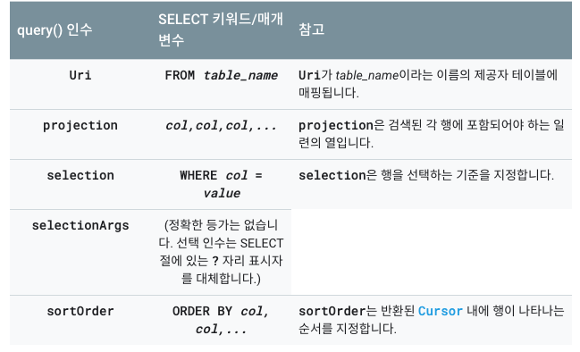

# Content provider


    * Android 애플리케이션의 마지막 4대 컴포넌트!!
    * 다른 애플리케이션에서 사용하도록 만든어진 것
    * 표준 인터페이스를 제공하여 프로세스간 통신과 보안 데이터 엑세스 처리
    * Context 에서 ContentResolver 객체를 사용하여 접근
    * Android 에서 비디오/이미지/주소록 등에서 사용

## ContentResolver

    * ContentProvider 데이터에 엑세스
    * 데이터에 CRUD 기능 제공


### 데이터 읽기

1. 매니페스트에 권한 표시
2. 쿼리 작성
3. 쿼리결과를 커서 객체로 받아 작업

- Permission 요청
```xml
AndroidManifest.xml
<uses-permission android:name="android.permission.READ_CONTACTS"/>
```    

- 컨텐트 URI - provider 데이터를 정의 (주소?)
```
    UserDictionary.Words.CONTENT_URI
    content://user_dictionary/words
```

- Provider로 데이터 가져오기

- 쿼리

```kotlin
   fun getContacts() : String {
        val c = contentResolver.query(
            ContactsContract.CommonDataKinds.Phone.CONTENT_URI,
            null,
            null,
            null,
            null)

        var str = ""
        when (c?.count) {
            null -> {
                //에러
            }
            0 -> {
                //결과없음
            }
            else -> {
                // Insert code here to do something with the results

                c.moveToFirst()

                do {
                    val name = c.getString(
                        c.getColumnIndex(ContactsContract.CommonDataKinds.Phone.DISPLAY_NAME)
                    )
                    val phoneNumber = c.getString(
                        c.getColumnIndex(ContactsContract.CommonDataKinds.Phone.NUMBER)
                    )
                    str += "이름 : $name , 폰번호 : $phoneNumber\n"
                } while (c.moveToNext())
            }
        }
        return str
    }
```




```kotlin
// Queries the user dictionary and returns results
cursor = contentResolver.query(
        UserDictionary.Words.CONTENT_URI,   // The content URI of the words table
        projection,                        // The columns to return for each row
        selectionClause,                   // Selection criteria
        selectionArgs.toTypedArray(),      // Selection criteria
        sortOrder                          // The sort order for the returned rows
)
```

* mSelectionClause 직접 문자열 받을 경우 악의적 SQL 공격을 받을 수 있기 때문에, mSelectionClause ? 와  selectionArgs 매개변수를 사용해야 한다
* query() 는 Cursor를 반환
* SimpleCursorAdapter 로 Cursor를 직접 ListView Adapter로 지정할 수 있는데...ListView 안씀!!


### 데이터 삽입

 1. Uri 객체 생성
 2. 값을 저장하기 위한 ContentValues 생성
 3. ContentValudes.put() 으로 컬럼,값 입력
 4. getContentResolver.insert()
 
 ```kotlin
 // Defines a new Uri object that receives the result of the insertion
Uri mNewUri;

...

// Defines an object to contain the new values to insert
ContentValues mNewValues = new ContentValues();

/*
 * Sets the values of each column and inserts the word. The arguments to the "put"
 * method are "column name" and "value"
 */
mNewValues.put(UserDictionary.Words.APP_ID, "example.user");
mNewValues.put(UserDictionary.Words.LOCALE, "en_US");
mNewValues.put(UserDictionary.Words.WORD, "insert");
mNewValues.put(UserDictionary.Words.FREQUENCY, "100");

mNewUri = getContentResolver().insert(
    UserDictionary.Word.CONTENT_URI,   // the user dictionary content URI
    mNewValues                          // the values to insert
);
 ```

 ### 데이터 업데이트

 1. Uri 객체 생성
 2. 값을 저장하기 위한 ContentValues 생성
 3. ContentValudes.put() 으로 컬럼,값 입력
 4. getContentResolver.update()
 
 ```kotlin
 // Defines an object to contain the updated values
ContentValues mUpdateValues = new ContentValues();

// Defines selection criteria for the rows you want to update
String mSelectionClause = UserDictionary.Words.LOCALE +  "LIKE ?";
String[] mSelectionArgs = {"en_%"};

// Defines a variable to contain the number of updated rows
int mRowsUpdated = 0;

...

/*
 * Sets the updated value and updates the selected words.
 */
mUpdateValues.putNull(UserDictionary.Words.LOCALE);

mRowsUpdated = getContentResolver().update(
    UserDictionary.Words.CONTENT_URI,   // the user dictionary content URI
    mUpdateValues                       // the columns to update
    mSelectionClause                    // the column to select on
    mSelectionArgs                      // the value to compare to
);
 ```

### 데이터 삭제
 1. 삭제할 행 조건을 selection으로 지정
 2. getContentResolver.delete()
 
 ```kotlin

// Defines selection criteria for the rows you want to delete
String mSelectionClause = UserDictionary.Words.APP_ID + " LIKE ?";
String[] mSelectionArgs = {"user"};

// Defines a variable to contain the number of rows deleted
int mRowsDeleted = 0;

...

// Deletes the words that match the selection criteria
mRowsDeleted = getContentResolver().delete(
    UserDictionary.Words.CONTENT_URI,   // the user dictionary content URI
    mSelectionClause                    // the column to select on
    mSelectionArgs                      // the value to compare to
);
 ```


- String, int, long, float, double, 64KB 바이트배열 BLOB(Binary Large OBject) 가능
- ContentResolver.getType() 으로 MIME 유형 확인 (vnd.android.cursor.item/phone_v2)

## ContentProvider
 * 예제로 보자


## 링크
https://developer.android.com/guide/topics/providers/content-provider-basics?hl=ko

https://unikys.tistory.com/349

https://colomy.tistory.com/92