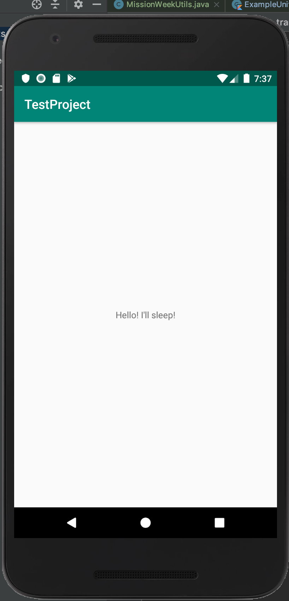
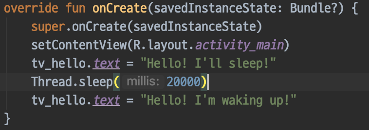
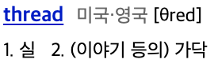
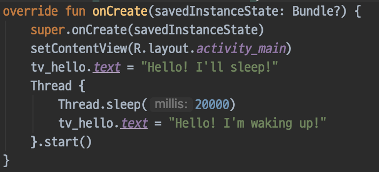
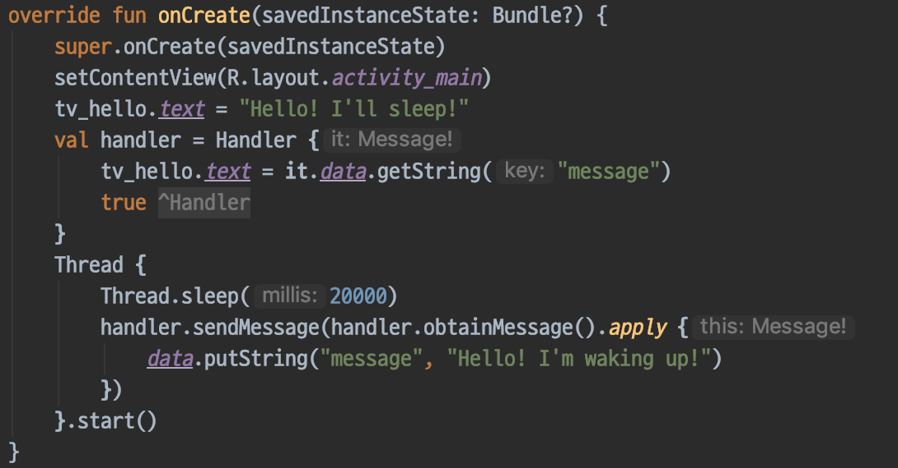
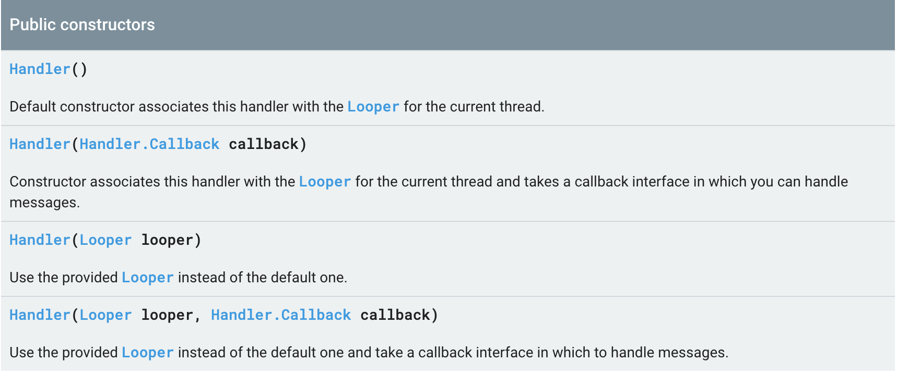
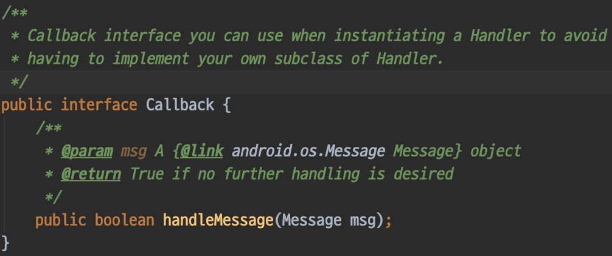
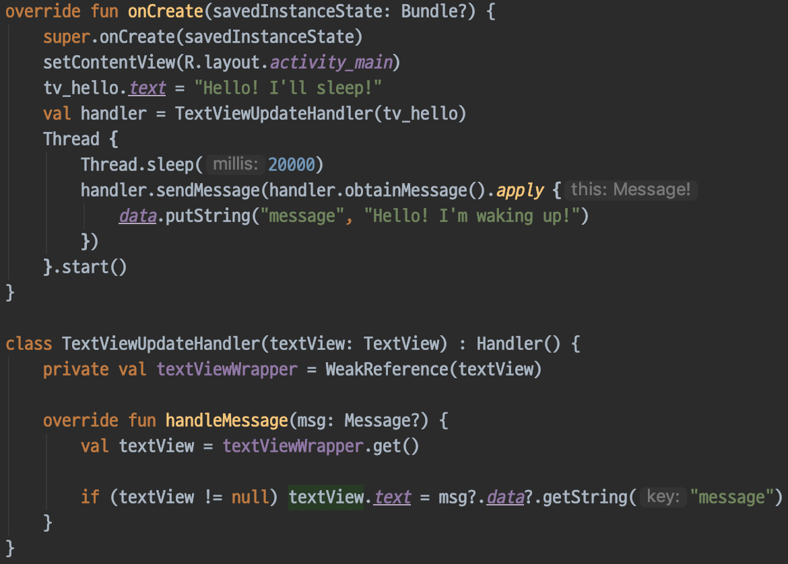
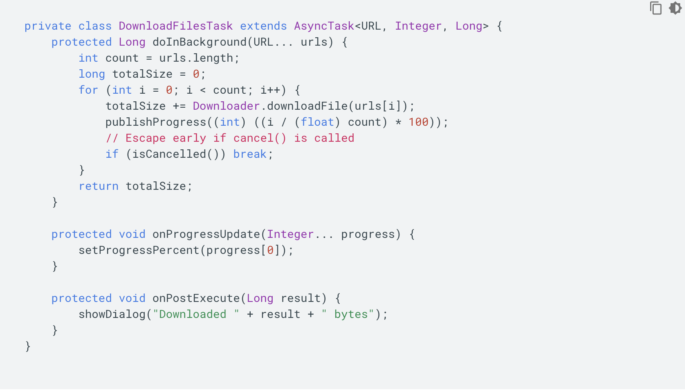

# Post

# Thread? Handler? Looper? What????

핸들러와 루퍼.

안드로이드 개발을 하다보면 한번쯤은 들어본 단어들 입니다.

스레드 통신할 때 필요하구나~ 정도로만 대충 기억하고

상세를 안드로메다로 날려버린 지식들 중 하나죠.

오늘은 이 녀석들을 안드로메다에서 끄집어내 보도록 하겠습니다.

# 간단한 시작

쉽게 이해를 하기 위해서 간단한 요구사항을 통하여 설명을 진행하겠습니다.

화면에 텍스트가 하나 있습니다. 이 텍스트를 20초 후에 다른 텍스트로 바꿔야 합니다.

그냥 가장 심플하게 생각해서 10초 스레드를 멈추고 업데이트하면 될 것 같아 보입니다.

까짓것 더 생각하기 귀찮으니 해보죠.

# 선생님 앱이 멈췄어요..

에..?

그렇습니다... 앱이 멈춰버렸습니다...

오래 기다리니 ANR 까지 뜨는군요.

진정하고 어째서 앱이 멈춰 버렸는지 파악해야 합니다.

왜 앱이 멈춰버렸을까요?

앱이 멈춘 이유는 아주 간단합니다.

"Thread.Sleep()" 를 부른 곳이 안드로이드의 메인 스레드이기 때문입니다.

메인 스레드는 다른 이름으로 UI 스레드 라고도 하는데 UI 업데이트를 담당하는 스레드라서 그렇고, UI 업데이트를 담당하는 스레드가 잠을 자버리니 당연히 앱이 멈춰버리게 되는거죠.

근데 스레드는 뭐죠?

...예?

# Thread

?

..??

위에 나온 스레드의 정의는 너무 추상적인데, 예를 들어보자면 스레드 하나는 사람 한명이라고 빗대볼 수 있을 것 같습니다. 한 명의 사람은 한번에 한가지의 일 만을 할 수 있지만, 공부를 하다가 잠시 멈추고 핸드폰을 할 수도 있고, 배가 고파져서 밥을 먹을 수도 있으며 밥을 먹다가도 택배가 오면 택배도 받을 수 있습니다. ~~저는 밥을 먹으며 핸드폰도 하고 공부도 할 수 있습니다.~~ 결론은 스레드 하나를 가지고 여러 작업을 하기 위해서는 기존 작업을 멈추고 진행해야 한다는 겁니다. 그럼 이제 스레드가 뭔지도 알았으니 실제로 새로운 스레드를 생성하여 작업을 옮겨보겠습니다.

Thread.sleep() 이후 부분을 새로운 스레드 안으로 옮겼습니다.

이젠 제대로 동작을 하겠죠?

# 선생님 이번엔 죽었는데요?

새로운 스레드를 생성하여 앱을 실행시키니 이번엔 앱이 죽어 버렸습니다.

이번엔 또 왜 죽었을까요?

에러 로그를 한번 볼까요?

해석을 하면

> 뷰 계층을 생성했던 스레드만이 해당 뷰에 접근할 수 있습니다.

?

간단히 말해 이전 코드는 메인 스레드에서 긴 작업을 수행하여 문제가 생겼었다면, 이번엔 다른 스레드에서 UI 를 업데이트 했으므로 에러가 난 겁니다. 메인 스레드는 UI 스레드 라고도 불린다고 했었죠? 이 스레드 외에 다른 곳에서는 UI 를 업데이트할 수 없습니다.

그렇다면 어떻게 해야 할까요?

바로 여기서 필요한 도구가 Handler 입니다.

# Handler

?

Handler 는 일반적인 개발용어로서 쓰이는 게 아닌 안드로이드에서만 쓰는 도구이다 보니 명확한 정의가 없군요.

Handler 는 Thread 간에 통신이 필요할 경우 쓰이는 도구입니다. Handler 공식 도큐멘트를 보면 다음과 같은 두가지 이유로 Handler 를 쓴다고 나와있습니다. 

> 1. 미래의 특정 시점에 실행 되어야하는 작업이 필요할 때

> 2. 현재 작업 중인 스레드가 아닌 다른 스레드에서 실행 되어야하는 작업이 필요할 때

저는 지금 다른 스레드에서 작업을 한 후 메인 스레드에서 UI 를 업데이트 해야 하니 2번 이유에 해당하여 핸들러가 필요하다고 볼 수 있습니다. 그러면 일단 가장 간단하게 문제가 일어난 부분을 Handler 를 사용하여 해결해보겠습니다.

새로 Handler 를 만들어서 Thread 에선 Handler 에게 업데이트 하라고 메시지만 보내는 방식으로 바뀌었습니다. 일단 문제는 해결되었습니다. 일단은요. ~~이대로 쓰면 메모리릭 나는데요?~~

위 코드에선 Handler 를 아주 간단하게 만들고 있지만 Handler 를 만드는 방법도, 메시지를 보내는 방법도, 받는 방법도 여러가지가 있습니다. 하나하나 알아보도록 합시다.

# Handler 생성

먼저 핸들러를 생성하는 방법부터 알아보겠습니다.

Handler 는 위의 4가지 생성자가 있습니다.

## 1. Handler() 로 생성하기

매개변수가 없는 기본 생성자 입니다.

이 생성자를 통해 Handler 를 생성하면 메시지를 받아서 처리할 수 있는 Handler.Callback 클래스를 등록할 수 있는 방법이 없기 때문에, 이렇게 생성할 땐 Runnable 인터페이스를 직접 보내는 방식으로만 Handler 를 사용할 때 아니면 안 사용하는 게 좋습니다. 하지만 Runnable 인터페이스로 Handler 를 사용하는 건 새 메시지를 보낼 때 마다 Runnable 인터페이스를 인스턴스화 시키기 때문에 별로 사용하지 않는 생성방식일 것 같습니다.

## 2. Handler(Handler.Callback callback) 로 생성하기

생성할 때 메시지를 처리할 Callback 을 등록하는 생성자 입니다.

Callback 은 정말 별거 없습니다.

Handler 에 postXXX 시리즈 메소드를 통해 메시지를 보냈을 때 핸들러 대신 해당 메시지를 처리 해줍니다.

위에 JavaDoc 으로 적혀 있듯이 Callback 을 넘겨주는 방식은 Handler 를 서브클래싱 하지않고 바로 인스턴스를 생성할 때 사용하는 방식입니다. 서브클래스를 사용할 필요가 없을 정도로 핸들러가 하는 작업이 간단한 게 아닐 경우 왠만하면 아래에서 서술할 서브클래스 정의 후 생성하는 방식을 사용하는 것이 좋아보입니다.

## 3. Handler(Looper looper) 로 생성하기

Looper 가 튀어나왔습니다.

Looper 에 대해서는 아래에서도 후술할 것이니 지금은 간략하게 Looper 란

> 특정 Thread 에 소속되며 어떤 Handler 에서 메시지를 보내든 무조건 자신이 소속된 Thread 가 해당 메시지를 처리하게 만드는 클래스

라고 이해하시면 될 것 같습니다.

~~대충 Looper 를 공부하며 제가 이해한 바를 간략하게 추려본 건데 다르다면 죄송합니다.. 좋은 피드백을 기다립니다...~~

이 생성자를 사용할 때의 의도는 "이 Handler 를 갖고있는 Thread 와 실제 작업을 수행하는 Thread 가 달라야 해" 정도라고 볼 수 있겠습니다. 왜냐면 Looper 를 넘기지 않고 Handler 를 생성할 경우 Handler 를 생성하는 Thread 의 Looper 가 Handler 의 Looper 가 되기 때문입니다.

## 4. Handler(Looper looper, Handler.Callback callback) 로 생성하기

사실 이 생성자에 대해서는 얘기할 것이 없습니다.

위에 서술한 2번과 3번의 조건이 둘 다 해당될 경우 사용하면 될 것 같습니다.

## 5. 서브클래스 정의 후 생성하기

Handler 를 사용 시 제가 사용하는 방식입니다.

위에 Handler 를 통해 TextView 를 20초 뒤에 업데이트 했던 코드에서 이 방식으로 바꿔 보겠습니다.

이런식으로 Handler 를 서브클래싱하는 이유는 Handler 가 하는 작업을 명확히 나타내기 위해서 입니다.

위 코드에선 Handler 의 이름을 TextViewUpdateHandler 로 지어서 코드를 읽기 전에 Handler 의 이름만으로 대충 TextView 를 갱신하는 Handler 라고 이해할 수 있죠. 그리고 이런 식으로 클래스를 떼어내어 분리를 시켜두어야지 실제 핸들러를 사용하는 부분(여기선 Activity의 onCreate())의 코드가 복잡하지 않고 간결하게 유지됩니다. 재사용성은 사실 Handler 에는 적용되지 않는 장점인 것 같습니다. Handler 를 사용할 만한 작업들은 일반화 시킬 수 있는 부분이 거의 없고 일반적으로 Handler 가 handleMessage() 메서드 내부에서 처리하는 작업은 한 두가지가 아니기 때문입니다. 그래서 제 개인적으론 편하게 Background 작업을 하려면 AsyncTask, RxJava, Coroutine 등을 사용하는 것이 더 좋다고 봅니다. ~~그래서 전 RxJava 를 씁니다.~~

# Handler 로 메시지 전송

Handler 로 메시지를 보낼 때 보낼 수 있는 타입은 다음과 같은 세가지 입니다.

### Message

1. Handler 에 보내서 처리시킬 데이터들의 집합체
2. Bundle, Runnable, Int, Object 등 다양한 데이터를 포함 가능
3. Message.obtain() 메소드를 통해 재사용이 가능하니 매번 new Message() 로 새로 생성하지 말고 해당 메소드를 사용하는 것을 추천

### Runnable

1. Thread 에서 실행할 하나의 작업단위
2. Handler 를 쓸 때 사용 시 매번 Runnable 객체가 새로 생성되기 때문에 샘플이나, 가벼운 앱 만들 때만 사용하는 것이 좋음

### Empty Message(int)

1. Handler 에서 무슨 작업을 할 지 결정하는 플래그 값으로 사용
2. 단순한 Int 값으로, 이 값을 보내면 받을 때 handleMessage(Message msg) 의 msg.what 값을 통해서 처리함
3. sendEmptyMessageXXX 시리즈를 통해서 보내는데, 내부적으로 Message.obtain() 을 통해서 설정하기 때문에 Runnable 과 같은 성능 이슈는 없음

위와 같은 타입들을 Handler 로 전송하기 위해 정의 되어있는 메소드가 무수히 많은데.. 접미사가 같을 경우 동작도 동일하니 공통적으로 보겠습니다.

일단 메시지를 보내는 메소드는 접두사가 다른 postXX 와 sendXX 가 있습니다.

postXX 메소드는 Runnable 을 매개변수로 받습니다. postXX 로 메시지를 보내게 되면 handleMessage() 로 이벤트가 오지 않으며 메시지가 처리되는 시점에 바로 실행이 됩니다.

sendXX 메소드는 Message, Int 둘 중 하나를 매개변수로 받습니다. sendXX 로 메시지를 보내게 되면 메시지가 처리되는 시점에 handleMessage()  가 호출됩니다.

접미사가 다른 메소드들은 postXX 와 sendXX 에 둘다 존재하며 의미로는

XXAtFrontOfQueue - 메시지큐 가장 앞에 메시지를 넣습니다.

XXAtTime - 매개변수로 지정한 시점에 실행되도록 설정하여 메시지큐에 넣습니다.

XXDelayed - 매개변수로 지정한 시간만큼 기다렸다가 실행되도록 설정하여 메시지큐에 넣습니다.

여기서 메시지큐 라는 용어가 생소할 수도 있는데, 메시지큐는 Handler 가 전달받은 메시지들을 저장 해두는 공간이고 보면 될 것 같습니다. 중요한 점은 전송한 메시지들이 전송한 순서대로 실행되지 않는다는 점 입니다.

그러므로 먼저 진행 되어야하는, 또는 나중에 진행 되어야하는 작업들은 Handler 를 통해 진행하지 않는 것이 좋습니다.

## Handler 로 메시지 처리

메시지 처리도 여러가지 방법이 있다고 했습니다만, 사실 전송하는 방식에 따라 Handler 가 처리하는 방식이 여러가지 인 것이지 개발자가 메시지를 처리하는 방식은 HandleMessage() 를 정의하는 것 한 가지밖에 없습니다.  대신 이 handleMessage 를 가지는 Callback 을 가질 수 있는 곳이 여러 군데 있는데

1. Message
2. Handler
3. Handler 상속 후 handleMessage 재정의

1번은 Message.obtain() 시 매개변수로 정의할 수 있으며, 2번은 Handler() 로 생성 시, 3번은 Handler 를 상속받아 오버라이딩 하면 정의가 가능합니다. 만약 세 개가 다 정의되어 있다고 가정할 경우, 숫자 순서대로 우선순위가 높습니다. 우선순위가 높은 곳에 Callback 이 존재할 경우 그보다 낮은 우선순위의 Callback 들은 전부 무시되기 때문에 유의하셔야 합니다.

# Handler 정리

좀 알기 쉽고 간단하게 쓰고자 하였습니다만.. 이 정도 내용 만으로도 글이 꽤 길어지는 것 같습니다.

Handler 를 요약하자면

1. 메시지를 전송한다.
2. 메시지를 처리한다.

이 두가지 일을 한다고 볼 수 있는데, 사실 까보면 하는 일이 더 많이 있습니다.

Handler 가 제대로 다루면 어렵다고 여겨지는 부분인 이유이죠.

위의 두가지 작업도 간단하게 이야기하려고 저렇게 추려 썼으나 정확히 이야기하면 메시지를 생성하는 생성자 입장에선 메시지큐에 메시지를 전송하고 보관할 수 있는 역할인 동시에 메시지를 소비하는 소비자 입장에선 메시지가 왔는지 수신하고 메시지를 처리하는 역할도 겸임하고 있는 겁니다. 이런 역할을 디자인 패턴으로 봤을 때 생산자-소비자 패턴에 해당합니다. 그러나 약간 다릅니다. 왜 다를까요? 그것이 Looper 가 있는 이유입니다.

# Looper

지금까지 제가 Handler 로 메시지를 보낸다 라는 말을 했는데, 사실 그렇지 않습니다.

Handler 로 보내면 Handler 는 그 메시지를 다시 Looper 에게 전송하는 역할만을 담당합니다.

그러면 메시지를 받은 Looper 는 자신이 갖고 있는 메시지큐에 그 메시지를 삽입합니다.

그리고 Looper 는 주기적으로 루프를 돌며 메시지큐에 있는 메시지들을 꺼내서 Handler 에게 전달하죠.

왜 이렇게 복잡한 구조를 가지고 있을까요? 가장 간단하게 말하면 Handler 를 사용하는 개발자가 편하게 사용하게 만들기 위해서 라고 생각합니다. 

## Pooling VS Push

위에서 얘기했던 생산자-소비자 패턴으로 구현된 구현체들은 생산자와 소비자 둘 다 Thread 입니다.

생산자 측에서 봤을 땐 동일하게 데이터를 전송하면 되므로 별 문제가 없지만 소비자 쪽에서는 Thread 를 만들고, 주기적으로 데이터큐에서 데이터를 빼내오는 부분까지 구현을 해야합니다. 이런 방식을 풀링 방식이라고 합니다. 그래서 구글이 개발자들이 더 편하게 개발하게 만들기 위하여 그런 부분까지 전부 Handler 라는 개념을 만들어서 감추고, 개발자는 Handler 를 만들고 메시지를 받을 부분만 정의하면 내부적으로 Looper 에서 주기적으로 루프를 돌아 등록 되어있는 Handler 에 메시지를 직접 밀어 넣어주는 방식으로 바꾼 거 같습니다. 이런 방식을 푸시 방식이라고 합니다. Looper 를 간단히 말해보자면 주기적으로 루프를 돌면서 메시지큐에 메시지가 있는지 확인하며, 메시지가 있을 경우 Handler 에 메시지를 전달해주는 놈 이라고 할 수 있겠습니다.

# Looper 와 Thread 의 관계

위에서 Looper 는  주기적으로 루퍼를 돌며 메시지를 전달한다고 했습니다.

그럴려면 메시지큐에 메시지가 없어도 Looper 는 살아있어야 하니 당연히 Looper 는 Thread 의 구현체라고  생각했지만 아닙니다. Looper 는 생성자에서 Thread 를 받는데 생성자는 private 라서 외부에서 호출을 할 수 없으며 Looper.prepare() 를 호출 시 생성자가 호출되는 형태로 구현되어 있습니다. 그 후 Looper.loop() 를 호출하여 해당 Thread 가 유지되도록 홀딩시킵니다. 이 프로세스를 거친 후에야 이제 Handler 를 통해 메시지큐에 메시지를 집어넣을 수 있게 되는 겁니다. 사실 왜 이렇게 복잡하게 만들어 두었는지는 저도 잘 모르겠습니다... 그들만의 생각이 있겠지요.. 정리해보면 Looper 는 단발성으로 끝나는 Thread 에 루프를 걸어줌으로서 Thread 가 종료되지 않게 유지 시켜주는 역할을 하고 있다고 보면 될 것 같습니다.

# Looper 와 Handler 의 관계

Handler 는 받은 메시지를 다시 Looper 에게 전달한다고 했습니다.

Handler 가 Looper 의 인스턴스를 갖고 있다는 이야기가 되니 Handler 는 Looper 에 의존성이 있다고 볼 수 있죠. 그러나 Looper 는 Handler 에 의존성이 없습니다. 그저 자신의 메시지큐를 Handler 가 가져갈 수 있도록 제공해줄 뿐입니다. 메시지큐를 Looper 가 들고있기 때문에, 하나의 Looper 에 다수의 Handler 가 붙을 수 있습니다. Handler 에서 Looper 로 메시지를 보낼 때 메시지의 target 파라미터를 Handler 자신으로 지정하여 보내기 때문에, Looper 에서 메시지를 보낼 때 이 target 파라미터를 통해 올바른 Handler 로 알아서 보내주니 사용할 땐 별 상관하지 않아도 됩니다. Handler 를 다수 정의하여 쓰이는 상황이 얼마나 있을지는 잘 모르겠지만요...

# 번외 : AsyncTask

Android 에서 Thread 전환처리를 할 수 있는 또 다른 도구입니다.

Handler 와 Thread 가 하는 일을 좀 더 편하게 사용하기 위한 Helper Class 라고 보시면 됩니다.

Handler 와 AsyncTask 의 차이점을 비교해보자면

### Handler

1. 재활용 가능
2. 작업 단위가 여러개 일 때 사용
3. 지연 처리 가능

### AsyncTask

1. 일회용
2. 작업 단위가 하나일 때 사용(단발성)
3. Background 작업 전용

사실 AsyncTask 는 Handler 의 Helper 개념이라 Handler 에서 Background 작업만을 더 특화시켜서 사용하기 편하게 만든 도구이다 보니 차이점이라고 하기 보단 사용 시 고려할 점 이라고 봐야할 것 같습니다.

AsyncTask 는 워낙 사용하기도 간단하고, 자세하게 설명해둔 포스팅도 많이 존재를 하고, AsyncTask 에서 추가된 특별한 기술이나, 새로운 개념이 도입된 것도 아니라서 굳이 사용법 들을 일일이 파헤치는 것도 시간낭비 같아서 공식 도큐멘트의 사용법 사진 하나와 링크를 올리고 마치도록 하겠습니다. 

~~젤리빈 이하를 지원하는 앱이라면 버그가 생길 수 있지만 설마 아직도 지원하는 회사는 없겠죠?~~

[https://developer.android.com/reference/android/os/AsyncTask](https://developer.android.com/reference/android/os/AsyncTask)

# Conclusion

Handler 는 다른 Thread 에서의 작업이 필요할 때나 지연처리가 필요할 때 쓰이는 도구입니다.

사용하기에는 간단하지만 구글이 복잡한 처리를 전부 감춰둬서 그렇다는 것을 알고 있어야 합니다. 모르면 버그가 날 수 있는 부분들도 지정하지 않으면 알아서 처리하는 로직들이 꽤 많아서 최대한 여기저기 둘러보며 글을 적어보았습니다. 처음 작성하는 글이라 그런지 제대로 잘 적었는지 모르겠네요. 제 개인적으로 정리를 하는 느낌으로 작성을 하다보니 의식의 흐름대로 적은 것 같기도 하네요 ㅎㅎ; 이 글이 도움이 되기를 바라며 다음 글에서 뵙겠습니다. :)